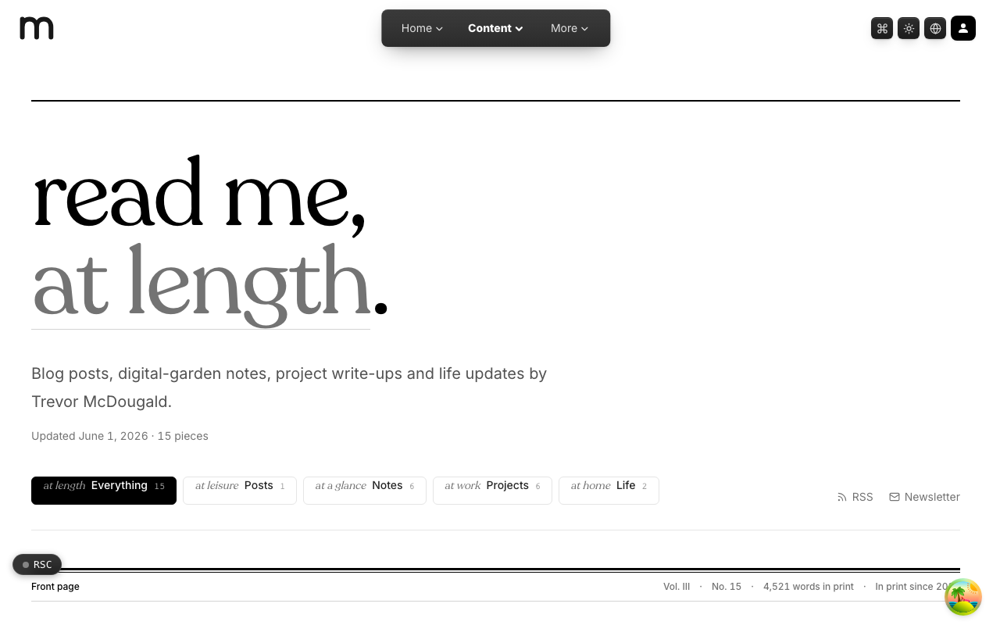
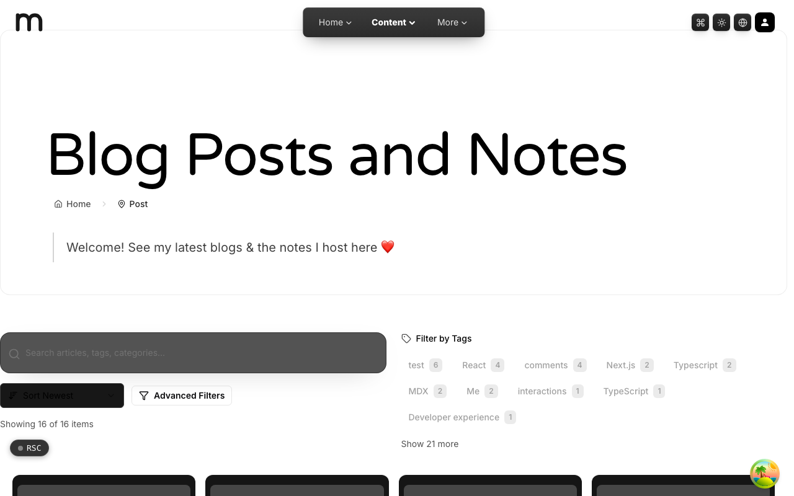
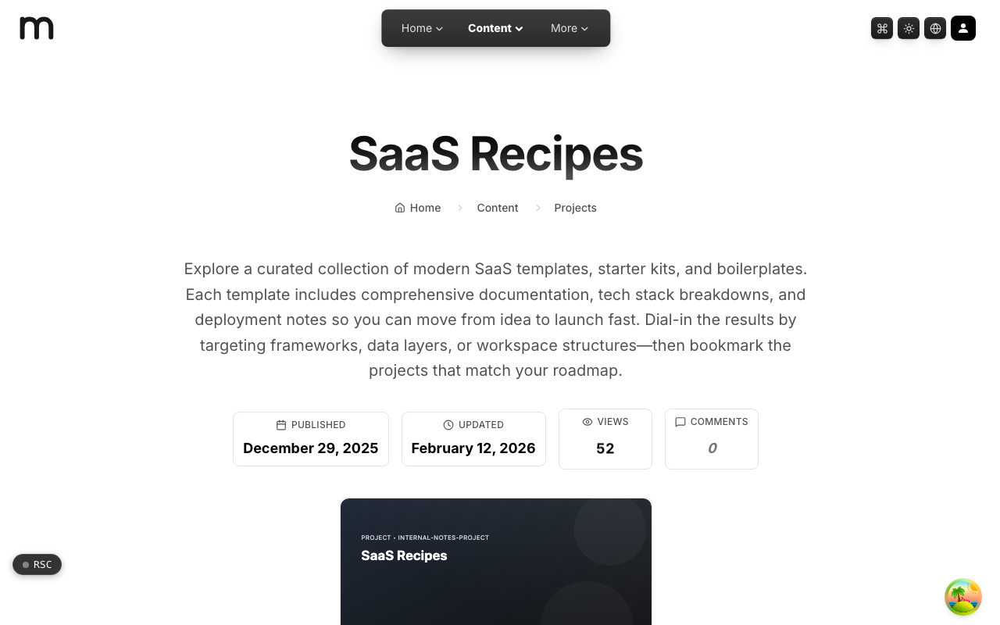
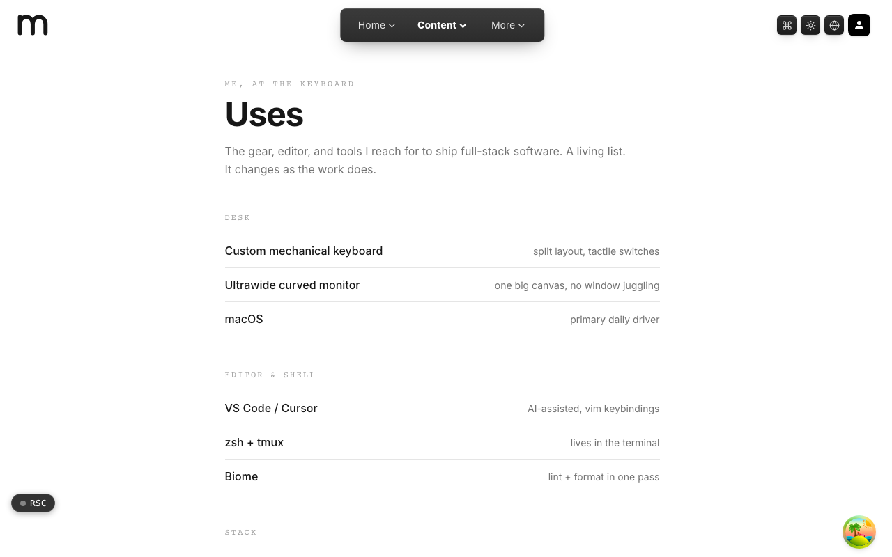

  <picture>
    <source media="(prefers-color-scheme: dark)" srcset=".github/assets/hero-dark.png">
    
  </picture>

# read.me.at

Read me, at length.

read.me.at is the long-form content home of the `*.me.at` family: blog posts, digital-garden notes, project write-ups and life updates by Trevor McDougald, a full-stack software engineer working in React, Next.js and modern web technologies. It brings the writing together in one place with search, comments, a newsletter and RSS.

**Live:** [read.me.at](https://read.me.at)

## Features

- **Four collections**: posts, notes, projects and life updates, each with its own index and a unified front page.
- **Article pages**: table of contents, multi-part series, previous and next navigation, and related posts.
- **Full-text search**: search across article bodies, with scored results, snippets and highlighting.
- **Comments and reactions**: threaded comments with reactions and reply notifications, using the shared me.at account.
- **Newsletter**: double opt-in subscribe, confirm and unsubscribe.
- **RSS feeds**: one feed for everything and one per collection.
- **Reader mode**: a distraction-free reading toggle.
- **Uses page**: the gear, editor and tools behind the work.

## Screenshots

<table>
  <tr>
    <td width="50%"><picture><source media="(prefers-color-scheme: dark)" srcset=".github/assets/post-dark.png"></picture> Blog posts and notes: search, sort and tag filters</td>
    <td width="50%"><picture><source media="(prefers-color-scheme: dark)" srcset=".github/assets/project--saas-tracking-dark.png"></picture> Project write-up: an article page with its stats</td>
  </tr>
  <tr>
    <td width="50%"> Uses: the gear, editor and tools behind the work</td>
    <td width="50%"></td>
  </tr>
</table>

## Built with

- Next.js 16 (App Router) and React 19
- TypeScript
- Tailwind CSS 4
- MDX compiled with Content Collections
- oRPC and TanStack Query
- Drizzle ORM and Postgres
- Better Auth (shared me.at account)

## Part of the me.at family

read.me.at is one of the [`*.me.at`](https://me.at) apps by Trevor McDougald. They share one design system, account, and app shell. Development happens in a private monorepo; this repository is the project's public-facing home.

## License

See [LICENSE](LICENSE).
